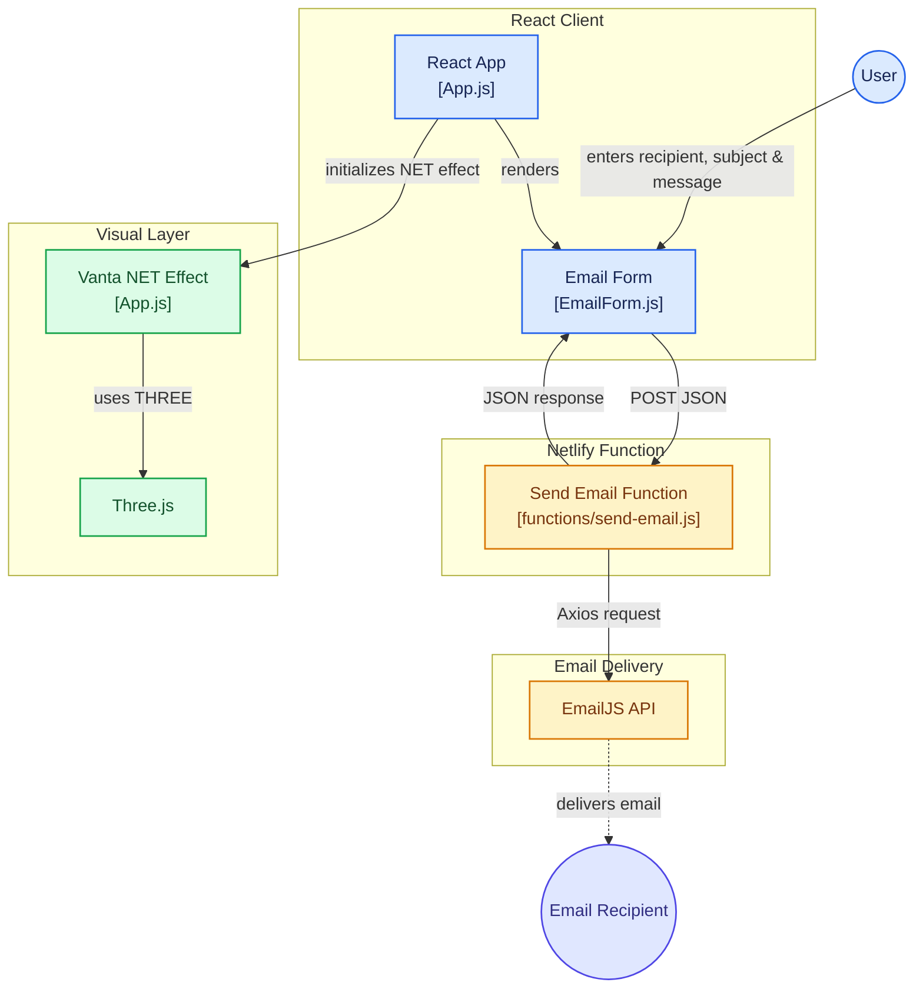
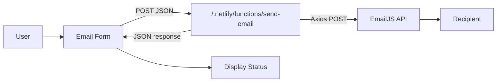
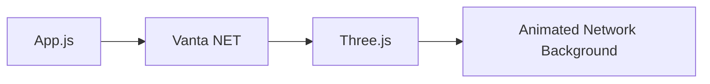

# 📧 Automatic Mail Sender Web App

A React-based web application for sending emails through a simple user interface. The application provides an email form, a Netlify serverless function for email delivery, and a dynamic Vanta.js background powered by Three.js.

🔗 **GitHub Repository:**
https://github.com/shaikyasirahmed07/automatic-mail-sender-webapp

---

## 📌 Overview

The **Automatic Mail Sender Web App** allows users to enter:

* Recipient email
* Email subject
* Message

The form sends the submitted data to a Netlify serverless function, which communicates with the EmailJS API to send the email.

The application also includes a Vanta.js animated background rendered using Three.js.

---

## 🏗️ Application Architecture



---

## ✨ Features

* 📧 Recipient email input
* 📝 Subject input
* 💬 Message input
* 📨 Email sending through EmailJS API
* ⚛️ React-based interface
* ☁️ Netlify serverless function
* 🌌 Vanta NET animated background
* 🎨 Three.js rendering
* 🔄 Sending status feedback
* 📱 Browser-based responsive interface

---

## 🛠️ Tech Stack

| Technology            | Purpose                                |
| --------------------- | -------------------------------------- |
| **React 19**          | Frontend application                   |
| **JavaScript**        | Application logic                      |
| **Axios**             | HTTP request from the Netlify function |
| **EmailJS API**       | Email delivery                         |
| **Netlify Functions** | Serverless email function              |
| **Vanta.js**          | Animated NET background                |
| **Three.js**          | Vanta rendering dependency             |
| **Create React App**  | React development/build tooling        |
| **Netlify CLI**       | Deployment                             |
| **Git & GitHub**      | Version control                        |

---

## 📂 Project Structure

```text
automatic-mail-sender-webapp/
│
├── public/
│
├── src/
│   ├── components/
│   │   └── EmailForm.js
│   │
│   ├── App.js
│   ├── App.css
│   └── ...
│
├── functions/
│   └── send-email.js
│
├── package.json
├── package-lock.json
└── README.md
```

---

## 🧩 Main Components

### `src/App.js`

The main React component:

* Renders the `EmailForm`
* Creates the Vanta NET background
* Passes the imported Three.js instance to Vanta
* Cleans up the Vanta effect when the component is unmounted

### `src/components/EmailForm.js`

The email form manages:

```text
to
subject
message
```

When submitted, it sends the form data to:

```text
/.netlify/functions/send-email
```

The component displays the response message and clears the form after a successful response.

### `functions/send-email.js`

The Netlify function:

1. Reads `to`, `subject`, and `message` from the request body.
2. Sends the data to the EmailJS API using Axios.
3. Returns a success response when the EmailJS request succeeds.
4. Returns an error response when the request fails.

---

## 🔄 Email Workflow



---

## 📋 Request Data

The frontend sends the following JSON structure to the Netlify function:

```json
{
  "to": "recipient@example.com",
  "subject": "Example Subject",
  "message": "Example message"
}
```

The Netlify function extracts these values and maps them to the EmailJS template parameters:

```text
to_email
subject
message
```

---

## 🌌 Visual Background

The application uses the **Vanta NET** effect in `App.js`.

The effect is initialized with:

* Three.js renderer
* Vanta NET
* Purple network color
* Black background
* Configured points
* Configured maximum distance
* Configured spacing

The effect is destroyed when the React component is unmounted.



---

## 🚀 Getting Started

### Prerequisites

Install:

* Node.js
* npm
* Git
* Netlify CLI if you want to use the included Netlify deployment scripts

Check Node.js and npm:

```bash
node --version
npm --version
```

Check Netlify CLI:

```bash
netlify --version
```

### Clone the Repository

```bash
git clone https://github.com/shaikyasirahmed07/automatic-mail-sender-webapp.git
cd automatic-mail-sender-webapp
```

### Install Dependencies

```bash
npm install
```

---

## 📜 Available npm Scripts

The repository defines the following npm scripts:

| Command               | Description                               |
| --------------------- | ----------------------------------------- |
| `npm start`           | Starts the React development server       |
| `npm test`            | Runs the Create React App test runner     |
| `npm run build`       | Creates the production build in `build/`  |
| `npm run eject`       | Ejects the Create React App configuration |
| `npm run deploy`      | Deploys the project using Netlify CLI     |
| `npm run deploy:prod` | Deploys the project to Netlify production |

### Development

```bash
npm start
```

The application runs at:

```text
http://localhost:3000
```

### Testing

```bash
npm test
```

### Production Build

```bash
npm run build
```

The production files are generated in:

```text
build/
```

### Eject

```bash
npm run eject
```

> This is optional and irreversible. It exposes the underlying Create React App configuration.

### Netlify Deployment

Preview deployment:

```bash
npm run deploy
```

Production deployment:

```bash
npm run deploy:prod
```

The Netlify CLI must be installed and configured before using these commands.

---

## 📧 Email Configuration

The current implementation uses the **EmailJS API from the Netlify serverless function**.

The EmailJS configuration is defined in:

```text
functions/send-email.js
```

The function contains:

```text
service_id
template_id
user_id
```

The current source uses placeholder values:

```text
YOUR_SERVICE_ID
YOUR_TEMPLATE_ID
YOUR_USER_ID
```

### Configure EmailJS

1. Create an EmailJS account.
2. Configure an email service.
3. Create an email template.
4. Obtain the EmailJS service ID.
5. Obtain the template ID.
6. Obtain the required user/public ID.
7. Replace the placeholder values in `functions/send-email.js`.

Example:

```javascript
service_id: 'YOUR_SERVICE_ID',
template_id: 'YOUR_TEMPLATE_ID',
user_id: 'YOUR_USER_ID',
```

> **Important:** The current implementation does not read these values from `REACT_APP_*` environment variables. Do not add environment-variable instructions unless the implementation is changed to support them.

---

## ▶️ Run Locally

Install dependencies:

```bash
npm install
```

Start the application:

```bash
npm start
```

Open:

```text
http://localhost:3000
```

### Netlify Function

The frontend submits requests to:

```text
/.netlify/functions/send-email
```

Email sending therefore depends on the Netlify Functions environment.

For local testing of the complete application, including the serverless function, use the Netlify CLI development environment.

---

## 🌐 Platform Support

This is a **web application**, not a native mobile or desktop application.

| Environment | Access               |
| ----------- | -------------------- |
| Web Browser | ✅ Primary target     |
| Android     | 🌐 Through a browser |
| iOS         | 🌐 Through a browser |
| Windows     | 🌐 Through a browser |
| macOS       | 🌐 Through a browser |
| Linux       | 🌐 Through a browser |

The repository does not contain separate native Android, iOS, Windows, macOS, or Linux application implementations.

---

## 🔐 Security Considerations

The current implementation contains EmailJS configuration values/placeholders inside the Netlify function source.

For production deployment:

* Do not commit real credentials to Git.
* Move sensitive configuration to Netlify environment variables.
* Update `send-email.js` to read credentials from `process.env`.
* Validate recipient email addresses.
* Validate the subject and message.
* Add rate limiting or abuse protection.
* Consider spam protection for a publicly accessible email endpoint.

---

## 🚀 Future Improvements

* [ ] Move EmailJS credentials to environment variables
* [ ] Add server-side input validation
* [ ] Add rate limiting
* [ ] Add spam protection
* [ ] Add loading indicator
* [ ] Add improved success/error notifications
* [ ] Add attachment support
* [ ] Add automated tests
* [ ] Improve accessibility
* [ ] Add deployment configuration improvements

---

## 🤝 Contributing

Contributions are welcome.

```bash
git checkout -b feature/new-feature
git add .
git commit -m "Add new feature"
git push origin feature/new-feature
```

Then open a Pull Request on GitHub.

---

## 📄 License

This project is available for educational and development purposes.

---

## 👨‍💻 Author

**Shaik Yasir Ahmed**

GitHub:
https://github.com/shaikyasirahmed07

Repository:
https://github.com/shaikyasirahmed07/automatic-mail-sender-webapp

---

## ⭐ Support

If you find this project useful, consider giving the repository a ⭐ on GitHub.
